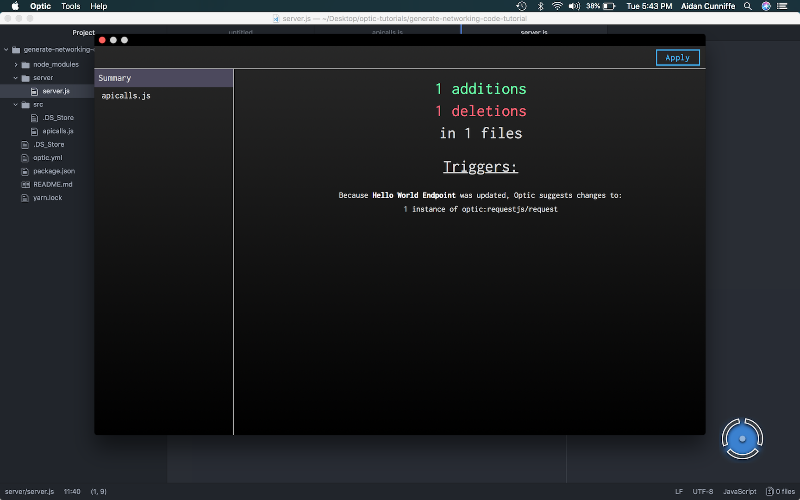
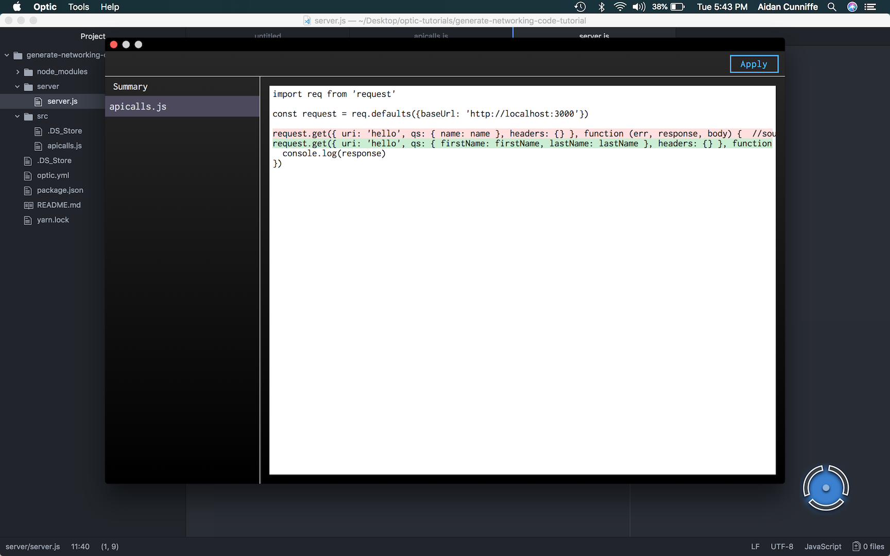

# Generate RequestJS calls for every route in an Express backend
Consuming REST APIs, even your own, is no walk in the park. It can take many iterations to get the inputs passing correctly and you may find yourself shooting in the dark if the endpoints aren't properly documented.  

In this tutorial we are going to configure Optic to automatically generate/maintain the networking code used to connect to an Express API. First Optic will read the source code and construct a representation of all the endpoints in the API. Then Optic transforms those endpoints into HTTP requests on the client.

## Requirements
* Isomorphic Node backend/frontend in a monorepo  
* [Express](https://expressjs.com/) REST API
* [Request](https://github.com/request/request) as the client networking library

I've included the source in a demo project to make it easy to try this out. [Download it here](https://github.com/acunniffe/optic-networking-code-demo).

## Including Skills
To get started we need to include some basic Javascript skills maintained by the Optic team. You can do this by updating the `optic.yml` file in your project's root directory.

We'll be adding 3 skill packages:
1. `optic:rest` - Contains the common schemas for endpoints, parameters, headers, and responses.
2. `optic:express-js` - The skills used for interfacing with express routes
3. `optic:requestjs` - Skills for interfacing with HTTP requests. Also contains the transformation from endpoint to request.

Once added, your updated `optic.yml` file should look something like this:

```yaml
name: Networking Code Demo

parsers:
  - es7

skills:
  - optic:express-js@0.3.0
  - optic:rest@0.3.0
  - optic:requestjs@0.3.0

exclude:
  - "node_modules"

```

Once you've updated your `optic.yml` file you can start up your favorite IDE and Optic to get started.

## Our First Transform
Because you have included the `optic:express-js` skill in your Optic configuration Optic can now read every express route in your project.

Add the following demo endpoint anywhere in your project or use one of your own to try Optic out on real data. When you select this code, Optic will light up. Open Optic by clicking on the glowing dot or CMD+Tab to the app.

```javascript
app.get('/hello', (req, res) => {
	res.send(200, 'Hello '+req.query.name)
}
```

You'll see that Optic interprets the above code as follows:
```json
{
	"url": "/hello",
	"method": "get",
	"parameters": [{
		"in": "query",
		"name": "name"
	}],
	"responses": [{
		"code": 200
	}]
}
```

Pretty cool! It auto documented the structure of the endpoint without any annotations or guidance.  

Now let's apply a transformation to turn this endpoint into a request.

^A transformation is a pure function that takes a JSON object that conforms to Schema A as input and returns a JSON object that conforms to Schema B.

In this case our transformation takes the JSON object above that represents an endpoint and returns a similar JSON object that represents a HTTP request.  

- Go to the transformations tab within Optic's GUI (the blue plus button at the bottom).
- Click on the transformation called "Request From Route"

The following code will appear beneath your endpoint:
```javascript
request.get({ uri: '/hello', qs: { name: name }}, function (err, response, body) {
  if (response.statusCode >= 200 && response.statusCode < 300) {

  } else {

  }
})
```

Optic has generated an HTTP Request by using its interpretation of the Route as input.

^Remember: Since you're using Optic you can edit the generated code and Optic will still be able to help you maintain it over time.

## Generating Networking Calls from your Client Code
The above example is great when you're exploring Optic, but it isn't very practical to generate networking code on the server when it's really needed in the client.

Before we do that, update your endpoint to include one of Optic's name annotations (more on those soon).

```javascript
app.get('/hello', (req, res) => { //name: Hello World Endpoint
	res.send(200, 'Hello '+req.query.name)
}
```

Then open any file in your client and use `///` to start an Optic search. Type in the name of the transformation we just used.
```javascript
///Request from Route
```

This time when you click the transformation it's going to ask you to select a route. In the dropdown you'll see one option for the `Hello World Endpoint` (hint: we just named this). If you select this option and hit "Apply" Optic will transform the route and insert the code in the current file.

Notice that Optic has added a source annotation that records the name of the model this code was generated from and the internal id of the transformation used.

```javascript
request.get({ uri: '/hello', qs: { name: name }}, function (err, response, body) { //source: Hello World Endpoint -> optic:requestjs/requestFromRoute {}
  if (response.statusCode >= 200 && response.statusCode < 300) {

  } else {

  }
})
```


### Name and Source Annotations
One of Optic's key design principles is making code the ultimate source of truth. We don't want to hide any information from the end user so when it comes to storing relationships between different sections of code we've elected to use annotations.

There are two kinds of annotations:
1. **Name Annotations** assign a name to a section of code. This provides a developer friendly way of referencing the models Optic finds in your code. There's a single project level namespace for these names so it's important to make them unique. {Name} + {Type} ie "Create User Endpoint" is a good pattern to follow
2. **Source Annotations** record the model and the transformation used to generate this section of code.

A single section of code can have both a name and a source annotation. For instance you can have:
1. An Endpoint named "Hello World Endpoint"
2. A Request named "Hello World Request", that has the source "Hello World Endpoint"
3. An HTML form with source "Hello World Request"

If you were to update the "Hello World Endpoint" Optic would update the request and form to correspond with the new structure of the endpoint.

## Syncing API & Networking Code
Every API changes which means your networking code will need to change as well. Traditional code generators are no help here, but since Optic can both read/write code you can use it maintain this generated code over time.

Remember all those name and source annotations? Optic uses those to create a acyclic graph representing the internal dependencies of your code. Each named model becomes a node and the source annotations become edges between them. When you press "Sync" in Optic it will diff the graph representing your current code base with the expected graph.

To see how this works let's first add some custom code to our request. For now I'm just going to replace the generated callback with a `console.log` of the response but you can put any custom code here.

```javascript
request.get({ uri: '/hello', qs: { name: name }}, function (err, response, body) { //source: Hello World Endpoint -> optic:requestjs/requestFromRoute {}
	console.log(response)
})
```

Now let's go back to the endpoint and add a `lastName` query parameter and change `name` to `firstName` like so:

```javascript
app.get('/hello', (req, res) => { //name: Hello World Endpoint
	res.send(200, `Hello ${req.query.firstName} ${req.query.lastName}`)
}
```

Head over to the Optic GUI and click "Sync". Optic will generate a patch for your request.





The new request should look like this. Notice how it only updated the query string and did not overwrite your custom code.

```javascript
request.get({ uri: '/hello', qs: { firstName: firstName, lastName: lastName }}, function (err, response, body) { //source: Hello World Endpoint -> optic:requestjs/requestFromRoute {}
	console.log(response)
})
```

Click "Apply" and patches will be applied and written to disk.

## Going Further
If you want to use another client networking or REST API library you can learn more about teaching Optic to work with new types of code in our [docs](https://useoptic.com/docs).

We're currently experimenting with making all of this work cross project (instead of just in monorepos) and cross language (Python backend w/ JS frontend). If you're interested in trying out those features email [aidan@useoptic.com](mailto:aidan@useoptic.com).


**Thanks for reading! I hope this saves you a lot of time and headaches.**  
